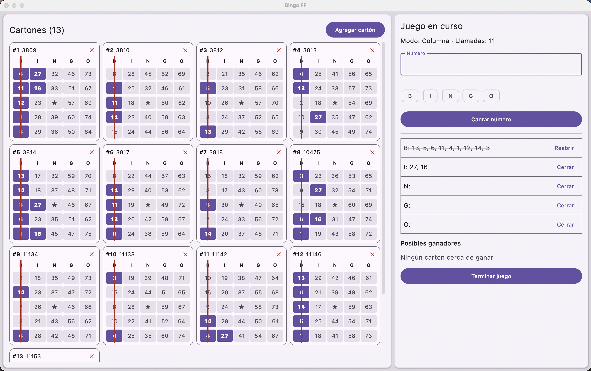

# Bingo FF

Desktop bingo companion for macOS, Windows and Linux. Register your boards, call numbers as the game goes on, and see every board update live.



## Features

- **Two-pane layout**: all boards on the left with called numbers marked live, game setup and play on the right.
- **Game modes**: Column, O, L, I and Full card.
- **Live win detection**: boards that complete the pattern are highlighted, and a "Possible winners" list shows which boards are closest.
- **Column control**: close and reopen B-I-N-G-O columns during a game; closed columns are struck through on every board.
- **Board management**: add boards by identifier, delete them, and export or import them as JSON (file or clipboard).
- **Persistence**: boards and the game in progress are stored locally and restored on startup.
- **Theme and language**: light, dark or system theme; Spanish and English UI.

## Tech stack

- Kotlin Multiplatform with Compose Multiplatform Desktop (JVM) and Material 3
- Room + bundled SQLite for local storage
- kotlinx.coroutines and kotlinx.serialization

## Requirements

- JDK 17 or newer (CI builds with Temurin 21)

## Getting started

```bash
# Run the app
./gradlew run

# Run the tests
./gradlew test

# Package an installer for the current OS (dmg, msi or deb)
./gradlew packageDistributionForCurrentOS
```

## Project structure

```
src/
  commonMain/    Domain model, game rules, win prediction, JSON codec, presentation state, strings
  desktopMain/   Compose UI, Room persistence, app entry point
  desktopTest/   Desktop UI tests
openspec/        Specs for each capability (boards, game play, session, export/import, theme, i18n...)
```

## Continuous integration

GitHub Actions runs the tests and packages the app on macOS, Windows and Ubuntu for every push to `main` and every pull request.
